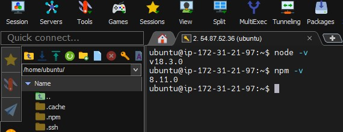

# WEB STACK IMPLEMENTATION (MERN STACK - MONGODB | EXPRESSJS | REACTJS | NODE.JS) IN AWS

## STEP 1 - BACKEND CONFIGURATION 

---

## APPLICATION CODE SETUP
Created new directory for Todo Project 

---

---

## INSTALL EXPRESSJS

### Installing express

---
### dotenv module installation

---
### Configuring index.js

---
### Testing Express Server

---
### Routes

---
### Models

---
### MongoDB

---

---
### Backend Configured

---

## TESTING BACKEND CODE WITHOUT FRONTEND USING RESTful API

### Postman POST

---
### Postman GET

---

## STEP 2 - FRONTEND CREATION

### Running a React App

---
### Creating your React Components

---
### Frontend Creation

---