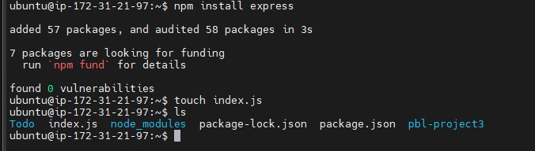

## WEB STACK IMPLEMENTATION (MERN STACK - MONGODB | EXPRESSJS | REACTJS | NODE.JS) IN AWS

### STEP 1 - BACKEND CONFIGURATION 

#### Application Code Setup
- Created new directory for Todo Project 

### STEP 2 - INSTALL EXPRESSJS

- dotenv module installation

- Configuring index.js

- Testing Express Server

- Routes

- Models

- MongoDB

